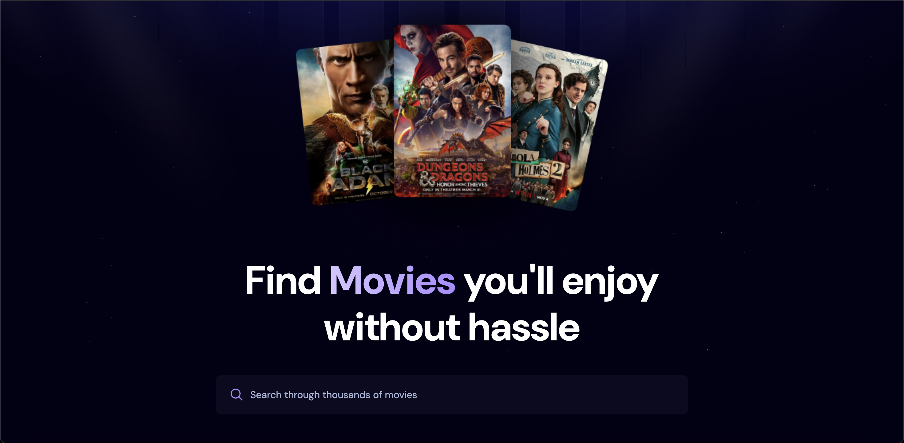

# 🎬 React Movie App

A modern movie discovery web app built with React, styled for a clean UI, and powered by the TMDB API.

🔗 **Live Demo**: [https://reactdevelopment-pied.vercel.app](https://reactdevelopment-pied.vercel.app)

## 📸 Preview


<!-- Replace with correct path if in a folder: docs/homepage-preview.png -->

---

## 🌟 Highlights

- 🧠 **Top 5 Movie Algorithm**: 
  - Uses **Appwrite backend API** to dynamically fetch and rank movies based on popularity, vote count, and other metrics.
  - Ensures only the **top 5 trending movies** are shown prominently on the homepage.

- 🔍 **Debounced Search Functionality**:  
  - Implements a **debounce mechanism** to limit rapid API calls during user typing.
  - This improves performance and avoids unnecessary requests to the movie database API.

---

## 🛠️ Tech Stack

- **React** (with Hooks)
- **Vite** (for fast dev/build)
- **TMDB API** (for movie data)
- **Appwrite** (for backend logic & movie ranking)
- **Vercel** (for deployment)
- **CSS / Tailwind / Styled Components** (whichever you used)

---

## 🙏 Acknowledgements

This project was built using the resources and guidance provided by **JS Master Pro** on YouTube.  
Huge thanks for the clear explanations and practical tutorials!

---

## 🚀 Features

- Browse trending movies
- View detailed movie info
- See **Top 5 algorithmically selected movies**
- Debounced search bar for efficient API handling
- Responsive design for all devices
- Graceful error handling (e.g., broken images, API failures)

---

## 🧑‍💻 How to Run Locally

```bash
git clone https://github.com/your-username/your-repo-name.git
cd your-repo-name
npm install
npm run dev
